# AI Composer 开发者手册

> **版本**：v0.1.0  
> **最后更新**：2026-06-07  
> **适用阶段**：Phase-05 Core Enhancement

---

## 目录

1. [项目概述](#第一部分项目概述)
2. [项目整体架构](#第二部分项目整体架构)
3. [目录结构](#第三部分目录结构)
4. [Shared 层](#第四部分shared-层)
5. [Core 层](#第五部分core-层)
6. [Provider 系统](#第六部分provider-系统)
7. [ConversationRuntime](#第七部分conversationruntime)
8. [WorkflowRuntime](#第八部分workflowruntime)
9. [Streaming 架构](#第九部分streaming-架构)
10. [Provider Config Center](#第十部分provider-config-center)
11. [Runtime Event Bus](#第十一部分runtime-event-bus)
12. [Workflow DAG 设计](#第十二部分workflow-dag-设计)
13. [React 层](#第十三部分react-层)
14. [Playground](#第十四部分playground)
15. [完整运行流程](#第十五部分完整运行流程)
16. [扩展指南](#第十六部分扩展指南)
17. [开发规范](#第十七部分开发规范)
18. [项目现状](#第十八部分项目现状)
19. [未来路线图](#第十九部分未来路线图)
20. [快速上手](#第二十部分快速上手)

---

## 第一部分：项目概述

### 1.1 AI Composer 是什么

AI Composer 是一个**企业级 AI Runtime Platform**，定位为跨框架 AI Studio SDK。它不是简单的 AI 输入框组件，而是一个完整的 AI 能力编排平台。

### 1.2 项目定位

| 定位维度 | 说明 |
|---------|------|
| **AI Runtime Platform** | 提供统一的 AI 模型运行环境，支持多种模型 provider |
| **Workflow Engine** | 内置 Workflow 引擎，支持多步骤 AI 任务编排 |
| **Provider Registry** | 统一的 Provider 注册和管理中心 |
| **React Component Library** | 提供开箱即用的 React 组件 |
| **Vue Adapter** | 提供 Vue 适配层（开发中） |

### 1.3 解决什么问题

```
┌─────────────────────────────────────────────────────────────────┐
│                        传统 AI 集成痛点                          │
├─────────────────────────────────────────────────────────────────┤
│ ❌ 每个模型需要单独集成                                          │
│ ❌ 缺乏统一的流式输出管理                                        │
│ ❌ 多步骤 AI 任务难以编排                                        │
│ ❌ UI 与业务逻辑耦合严重                                         │
│ ❌ 框架绑定（React/Vue 难以迁移）                                │
│ ❌ 缺乏统一的错误处理和重试机制                                  │
└─────────────────────────────────────────────────────────────────┘
                              ↓
┌─────────────────────────────────────────────────────────────────┐
│                    AI Composer 解决方案                            │
├─────────────────────────────────────────────────────────────────┤
│ ✅ Provider 统一抽象层 - 一个接口适配所有模型                    │
│ ✅ 内置 Streaming 架构 - 统一流式输出管理                        │
│ ✅ Workflow Engine - 声明式多步骤任务编排                      │
│ ✅ Core/UI 分离 - 业务逻辑与 UI 完全解耦                        │
│ ✅ 跨框架支持 - React + Vue 双框架                             │
│ ✅ 完整生命周期管理 - 错误处理、重试、中断                       │
└─────────────────────────────────────────────────────────────────┘
```

### 1.4 核心设计思想

#### 原则 1：框架无关（Framework Agnostic）

所有业务逻辑必须运行在 Core 层。禁止 React、Vue、DOM、Window、Document 出现在 Core 层。

```typescript
// ✅ Core 层只依赖原生 API
export class ConversationRuntime {
  private readonly conversation = new ConversationEngine();
  private readonly events = new EventBus<ConversationRuntimeEvents>();
  // 纯 TypeScript，无框架依赖
}

// ❌ 禁止在 Core 层引入 React/Vue
import { useState } from 'react'; // ← 禁止
```

#### 原则 2：UI 与业务解耦

React 和 Vue 只负责渲染。禁止组件直接调用模型，禁止组件直接请求 OpenAI。

```typescript
// ✅ UI 层只负责渲染
export function ConversationView({ messages }: ConversationViewProps) {
  return <div>{/* 纯渲染逻辑 */}</div>;
}

// ❌ 禁止在 UI 层直接请求 API
const response = await fetch('https://api.openai.com/...'); // ← 禁止
```

#### 原则 3：Provider 驱动

所有 AI 模型能力必须经过 Provider。统一接口。

#### 原则 4：Workflow First

所有 AI 能力最终统一为 Workflow。聊天、图片生成、视频生成、数字人、Agent 都属于 Workflow。

### 1.5 适合什么场景

| 场景 | 适用性 | 说明 |
|------|--------|------|
| 企业 AI 聊天应用 | ⭐⭐⭐⭐⭐ | 内置完整的对话 Runtime |
| AI 图像工作流 | ⭐⭐⭐⭐⭐ | 支持图像生成/编辑工作流 |
| 多模态 AI 应用 | ⭐⭐⭐⭐⭐ | 支持文本/图像/视频/音频/数字人 |
| AI Agent 平台 | ⭐⭐⭐⭐☆ | 内置 Agent Provider 接口 |
| 跨框架迁移 | ⭐⭐⭐⭐⭐ | Core 层可复用，只需重写 UI |
| 第三方模型接入 | ⭐⭐⭐⭐⭐ | Provider 注册机制灵活 |

### 1.6 未来规划方向

- **GPT-5.5** 完整接入
- **GPT-Image-2** 图像生成/编辑
- **Flux** / **即梦** / **可灵** 等国产模型
- **视频生成** / **音频生成** / **数字人**
- **RAG** 检索增强生成
- **多 Agent 协作**

---

## 第二部分：项目整体架构

### 2.1 分层架构图

```
┌─────────────────────────────────────────────────────────────────────────────┐
│                              UI Layer                                        │
│  ┌──────────────┐  ┌──────────────┐  ┌──────────────┐  ┌──────────────┐    │
│  │   AiComposer │  │Conversation  │  │ Workflow     │  │ AgentConv    │    │
│  │              │  │View          │  │Timeline      │  │Workspace     │    │
│  └──────┬───────┘  └──────┬───────┘  └──────┬───────┘  └──────┬───────┘    │
│         │                 │                 │                 │              │
│         └─────────────────┴─────────────────┴─────────────────┘              │
│                                    │                                        │
│                         ┌──────────▼──────────┐                           │
│                         │ useAgentConversation │                           │
│                         │ Controller           │                           │
│                         └──────────┬──────────┘                           │
└────────────────────────────────────┼──────────────────────────────────────┘
                                     │
                                     ↓
┌─────────────────────────────────────────────────────────────────────────────┐
│                          Runtime Layer (Core)                               │
│                                                                              │
│  ┌──────────────────┐    ┌──────────────────┐    ┌──────────────────┐      │
│  │ Conversation     │    │ Workflow         │    │ Provider         │      │
│  │ Runtime          │    │ Runtime          │    │ Registry         │      │
│  │                  │    │                  │    │                  │      │
│  │ • 消息生命周期   │    │ • 步骤编排       │    │ • 模型注册       │      │
│  │ • Streaming      │    │ • Provider 匹配  │    │ • 能力声明       │      │
│  │ • Abort 控制     │    │ • Retry 机制     │    │ • Metadata       │      │
│  └──────────────────┘    └──────────────────┘    └──────────────────┘      │
│                                                                              │
│  ┌──────────────────┐    ┌──────────────────┐    ┌──────────────────┐      │
│  │ Workflow Engine  │    │ Prompt Parser    │    │ Event Bus        │      │
│  │                  │    │                  │    │                  │      │
│  │ • 步骤执行       │    │ • 自然语言解析   │    │ • 事件发布/订阅  │      │
│  │ • 状态管理       │    │ • Workflow 分析  │    │ • 跨层通信       │      │
│  │ • 错误处理       │    │ • 关键词检测     │    │ • 类型安全       │      │
│  └──────────────────┘    └──────────────────┘    └──────────────────┘      │
│                                                                              │
└─────────────────────────────────────────────────────────────────────────────┘
                                     │
                                     ↓
┌─────────────────────────────────────────────────────────────────────────────┐
│                            Provider Layer                                   │
│                                                                              │
│  ┌──────────────┐  ┌──────────────┐  ┌──────────────┐  ┌──────────────┐    │
│  │ ChatProvider │  │ImageProvider │  │VideoProvider │  │AgentProvider │    │
│  │              │  │              │  │              │  │              │    │
│  │ • GPT-5.5    │  │ • GPT-Image  │  │ • 可灵       │  │ • Planning   │    │
│  │ • Claude     │  │ • Flux       │  │ • Runway     │  │ • Execution  │    │
│  │ • Qwen       │  │ • 即梦       │  │ • Veo        │  │              │    │
│  └──────────────┘  └──────────────┘  └──────────────┘  └──────────────┘    │
│                                                                              │
└─────────────────────────────────────────────────────────────────────────────┘
                                     │
                                     ↓
┌─────────────────────────────────────────────────────────────────────────────┐
│                             Model/API Layer                                  │
│                                                                              │
│   OpenAI    Claude    Qwen    即梦    可灵    Flux    Runway    Veo          │
│                                                                              │
└─────────────────────────────────────────────────────────────────────────────┘
```

### 2.2 各层职责说明

| 层级 | 职责 | 关键组件 |
|------|------|----------|
| **UI Layer** | 用户界面渲染，用户交互 | AiComposer, ConversationView, WorkflowTimeline |
| **Controller Layer** | 连接 UI 与 Runtime，状态管理 | useAgentConversationController |
| **Runtime Layer** | 核心业务逻辑，框架无关 | ConversationRuntime, WorkflowRuntime, ProviderRegistry |
| **Workflow Layer** | 工作流编排和执行 | WorkflowEngine, PromptParser |
| **Provider Layer** | AI 模型能力抽象 | ChatProvider, ImageProvider, VideoProvider |
| **Model/API Layer** | 真实 AI 模型 API | OpenAI, GPT-Image-2, 第三方模型 |

### 2.3 层间依赖关系

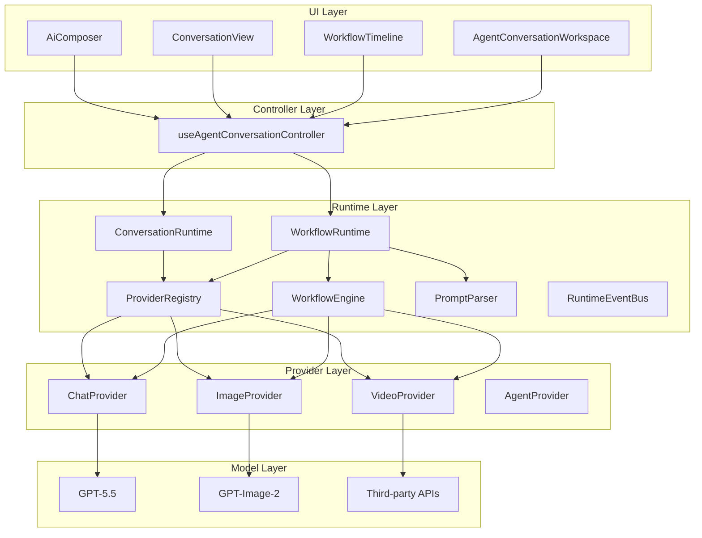

### 2.4 为什么这样设计

| 设计决策 | 原因 |
|----------|------|
| **分层架构** | 职责清晰，便于维护和扩展 |
| **Core/UI 分离** | UI 可替换（React→Vue），业务逻辑复用 |
| **Provider 抽象** | 模型可替换，不影响上层逻辑 |
| **Workflow 统一** | 所有 AI 能力统一抽象，便于扩展新能力 |
| **Event Bus** | 解耦组件间通信，支持跨层事件 |

---

## 第三部分：目录结构

### 3.1 Monorepo 目录树

```
ai-composer/
├── package.json                    # Workspace 根配置
├── pnpm-workspace.yaml            # pnpm workspace 配置
├── tsconfig.base.json             # 共享 TypeScript 配置
├── tailwind.config.ts             # 共享 Tailwind 配置
│
├── docs/                          # 文档目录
│   ├── AI-COMPOSER-DEVELOPER-HANDBOOK.md  # 本手册
│   ├── P0-Completion-Report.md            # P0 验收报告
│   └── Architecture Refactor Audit Report.md
│
└── packages/                      # 核心包目录
    │
    ├── shared/                    # 共享层
    │   ├── src/
    │   │   ├── index.ts           # 统一导出
    │   │   ├── composer.ts        # Composer 类型定义
    │   │   ├── theme.ts           # 主题 Token 定义
    │   │   ├── workflow.ts        # Workflow 类型定义
    │   │   └── types/             # 分类类型
    │   │       ├── index.ts       # 类型统一导出
    │   │       ├── provider.ts    # Provider 类型
    │   │       ├── runtime.ts     # Runtime 事件类型
    │   │       └── workflow.ts    # Workflow DAG 类型
    │   └── package.json
    │
    ├── core/                      # 核心业务逻辑层
    │   ├── src/
    │   │   ├── index.ts           # Core 统一导出
    │   │   ├── ConversationRuntime.ts    # 对话运行时
    │   │   ├── WorkflowRuntime.ts        # 工作流运行时
    │   │   ├── ProviderRegistry.ts       # Provider 注册中心
    │   │   ├── WorkflowEngine.ts       # 工作流引擎
    │   │   ├── PromptParser.ts         # 提示词解析器
    │   │   ├── ConversationEngine.ts   # 对话状态引擎
    │   │   ├── provider-config/        # 配置管理
    │   │   │   ├── index.ts
    │   │   │   └── ProviderConfigManager.ts
    │   │   ├── events/                 # 事件系统
    │   │   │   ├── index.ts
    │   │   │   └── RuntimeEventBus.ts
    │   │   └── plugins/                # 插件系统
    │   │       ├── CommandPlugin.ts
    │   │       ├── MentionPlugin.ts
    │   │       └── UploadPlugin.ts
    │   └── package.json
    │
    ├── providers/                 # Provider 实现层
    │   ├── src/
    │   │   ├── index.ts           # Provider 统一导出
    │   │   ├── types.ts           # Provider 接口定义
    │   │   ├── config.ts          # 配置解析
    │   │   ├── errors.ts          # Provider 错误定义
    │   │   ├── http.ts            # HTTP 请求工具
    │   │   ├── metadata/          # Provider Metadata
    │   │   │   └── index.ts
    │   │   ├── chat/              # Chat Provider
    │   │   │   └── GPTProvider.ts
    │   │   └── image/             # Image Provider
    │   │       └── GPTImageProvider.ts
    │   └── package.json
    │
    ├── react/                     # React 适配层
    │   ├── src/
    │   │   ├── index.ts           # React 包统一导出
    │   │   ├── components/        # React 组件
    │   │   │   ├── AiComposer.tsx
    │   │   │   ├── ConversationView.tsx
    │   │   │   ├── WorkflowTimeline.tsx
    │   │   │   ├── AgentConversationWorkspace.tsx
    │   │   │   └── ...
    │   │   ├── controllers/       # React Controllers
    │   │   │   └── useAgentConversationController.ts
    │   │   ├── core/              # React 层 Core 适配
    │   │   └── plugins/           # React 层插件
    │   └── package.json
    │
    ├── vue/                       # Vue 适配层
    │   ├── src/
    │   │   └── index.ts           # Vue 包统一导出
    │   └── package.json
    │
    └── playground/                # 示例项目
        ├── src/
        │   ├── App.tsx            # Playground 主应用
        │   ├── main.tsx           # 入口
        │   ├── ComponentDemos.tsx # 组件演示
        │   ├── GPTPlayground.tsx  # GPT Provider 演示
        │   └── RuntimePlayground.tsx # Runtime 演示
        └── package.json
```

### 3.2 包依赖关系图

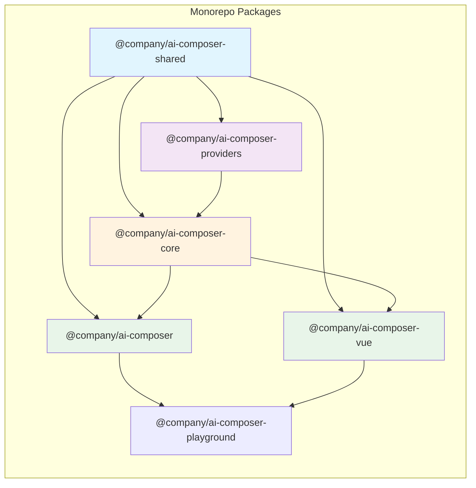

### 3.3 依赖规则矩阵

| 源包 ↓ / 目标包 → | shared | core | providers | react | vue |
|------------------|--------|------|-----------|-------|-----|
| **shared** | - | ❌ | ❌ | ❌ | ❌ |
| **core** | ✅ | - | ✅ | ❌ | ❌ |
| **providers** | ✅ | ❌ | - | ❌ | ❌ |
| **react** | ✅ | ✅ | ✅ | - | ❌ |
| **vue** | ✅ | ✅ | ✅ | ❌ | - |
| **playground** | ✅ | ✅ | ✅ | ✅ | ✅ |

**说明**：
- ✅ 允许依赖
- ❌ 禁止依赖（会导致循环依赖或架构混乱）

### 3.4 各包职责边界

| 包名 | 职责 | 禁止事项 |
|------|------|----------|
| **shared** | 类型定义、主题 Token、常量 | 禁止包含任何逻辑代码 |
| **core** | 业务逻辑、状态管理、事件系统 | 禁止引入 React/Vue/DOM |
| **providers** | Provider 接口和实现 | 禁止依赖 UI 层 |
| **react** | React 组件和 Hooks | 禁止包含业务逻辑（应调用 Core） |
| **vue** | Vue 组件和 Composables | 禁止包含业务逻辑（应调用 Core） |

---

## 第四部分：Shared 层

### 4.1 定位与职责

Shared 层是整个项目的**统一类型中心**。它定义了所有跨包共享的类型、接口和常量，确保类型一致性。

### 4.2 核心文件说明

#### 4.2.1 `composer.ts` - Composer 核心类型

```typescript
// Attachment 定义
export interface Attachment {
  id: string;
  type: "image" | "video" | "audio" | "file" | "avatar";
  url: string;
  name?: string;
  mimeType?: string;
}

// Composer 阶段
export type ComposerPhase = "idle" | "generating";

// 附件上传状态
export type AttachmentStatus = "ready" | "invalid";

// Composer 上下文模式
export type ComposerContextMode = "none" | "mention" | "command";
```

#### 4.2.2 `workflow.ts` - Workflow 类型

```typescript
// 消息定义
export interface Message {
  id: string;
  role: "user" | "assistant" | "system";
  content: string;
  attachments?: Attachment[];
  status?: "pending" | "streaming" | "success" | "error";
  createdAt: number;
}

// Workflow 步骤类型
export type WorkflowStepType =
  | "chat"
  | "image_generate"
  | "image_edit"
  | "image_replace"
  | "video_generate"
  | "image_to_video"
  | "avatar_generate"
  | "avatar_talking_video"
  | "agent_task";

// Workflow 步骤
export interface WorkflowStep {
  id: string;
  type: WorkflowStepType;
  title: string;
  prompt?: string;
  status: "waiting" | "running" | "success" | "error";
  output?: unknown;
  provider?: string;
  error?: string;
  startedAt?: number;
  completedAt?: number;
}

// Workflow 执行结果
export interface WorkflowExecutionResult {
  steps: WorkflowStep[];
  finalOutput?: unknown;
}
```

#### 4.2.3 `types/provider.ts` - Provider 类型

```typescript
// Provider 能力声明
export interface ProviderCapability {
  provider: string;
  supports: WorkflowStepType[];    // 支持的步骤类型
  inputTypes?: ProviderIOType[];   // 输入类型
  outputTypes?: ProviderIOType[];  // 输出类型
  streaming?: boolean;              // 是否支持流式
  batch?: boolean;                // 是否支持批量
  configurable?: boolean;         // 是否可配置
  maxFiles?: number;               // 最大文件数
  metadata?: Record<string, unknown>;
}

// Provider 元数据
export interface ProviderMetadata {
  id: string;
  name: string;
  description?: string;
  icon?: string;
  website?: string;
  category: "chat" | "image" | "video" | "audio" | "avatar";
  status: "stable" | "beta" | "experimental";
  pricing?: string;
  tags?: string[];
}
```

#### 4.2.4 `types/runtime.ts` - Runtime 事件类型

```typescript
// Runtime 事件名称
export type RuntimeEventName =
  | "workflow:start"
  | "workflow:complete"
  | "workflow:error"
  | "step:start"
  | "step:success"
  | "step:error"
  | "conversation:start"
  | "conversation:message"
  | "conversation:complete";

// 事件负载映射
export interface RuntimeEventPayloadMap {
  "workflow:start": { state: unknown };
  "workflow:complete": { state: unknown };
  "workflow:error": { error: unknown; state?: unknown };
  "step:start": { step: WorkflowStep; state?: unknown };
  "step:success": { step: WorkflowStep; state?: unknown };
  "step:error": { step: WorkflowStep; error: unknown; state?: unknown };
  "conversation:start": { message: Message };
  "conversation:message": { message: Message };
  "conversation:complete": { message: Message };
}
```

### 4.3 为什么存在 Shared 层

1. **类型一致性**：确保跨包的类型定义完全一致
2. **避免循环依赖**：shared 层不依赖任何其他包
3. **版本管理**：类型变更可以独立版本控制
4. **IDE 支持**：为所有包提供完整的类型提示

### 4.4 如何新增类型

```typescript
// 1. 在 shared/src/ 下创建或编辑类型文件
// shared/src/types/new-feature.ts

export interface NewFeatureConfig {
  enabled: boolean;
  threshold: number;
}

export type NewFeatureStatus = "idle" | "processing" | "done";

// 2. 在 shared/src/index.ts 导出
export * from "./types/new-feature";

// 3. 在其他包中使用
import type { NewFeatureConfig } from "@company/ai-composer-shared";
```

### 4.5 如何避免重复定义

- **禁止**：在多个包中重复定义相同类型
- **规范**：所有跨包类型必须在 shared 层定义
- **检查**：Code Review 时检查类型定义位置

---

## 第五部分：Core 层

### 5.1 核心组件架构图

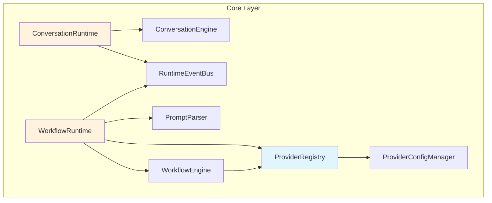

### 5.2 ProviderRegistry - Provider 注册中心

#### 职责
- 管理所有 Provider 的注册和查找
- 提供 Provider 能力查询
- 支持按步骤类型匹配 Provider

#### 核心代码

```typescript
export interface ProviderRegistryState {
  chat?: ChatProvider;
  image?: ImageProvider;
  video?: VideoProvider;
  avatar?: AvatarProvider;
  agent?: AgentProvider;
  workflowAnalyzer?: WorkflowAnalyzerProvider;
  promptOptimizer?: PromptOptimizerProvider;
}

export class ProviderRegistry {
  private state: ProviderRegistryState = {};

  // 批量注册
  register(registry: ProviderRegistryState): void {
    this.state = { ...this.state, ...registry };
  }

  // 单个 Provider 注册
  registerProvider<TKey extends ProviderKind>(kind: TKey, provider: ProviderByKind<TKey>): void {
    this.state = { ...this.state, [kind]: provider };
  }

  // 按类型获取 Provider
  getProviderForStep(type: WorkflowStepType): ChatProvider | ImageProvider | ... {
    if (this.state.image?.getCapability?.().supports.includes(type)) {
      return this.state.image;
    }
    // ... 更多匹配逻辑
  }

  // 列出所有能力
  listCapabilities(): ProviderCapability[] {
    return this.listProviders()
      .map(kind => {
        const provider = this.state[kind];
        return provider?.getCapability?.();
      })
      .filter(Boolean);
  }
}
```

#### 使用方式

```typescript
const registry = new ProviderRegistry();

// 注册 GPT Provider
registry.registerProvider("chat", new GPTProvider({
  apiKey: "sk-...",
  baseUrl: "https://api.openai.com/v1",
  model: "gpt-5.5"
}));

// 注册图像 Provider
registry.registerProvider("image", new GPTImageProvider({
  apiKey: "sk-...",
  baseUrl: "https://api.openai.com/v1",
  model: "gpt-image-2"
}));

// 获取 Provider
const chatProvider = registry.getProvider("chat");
const capabilities = registry.listCapabilities();
```

### 5.3 ConversationRuntime - 对话运行时

#### 职责
- 管理单轮/多轮对话生命周期
- 处理流式输出（Streaming）
- 支持对话中断（Abort）
- 管理消息状态

#### 生命周期

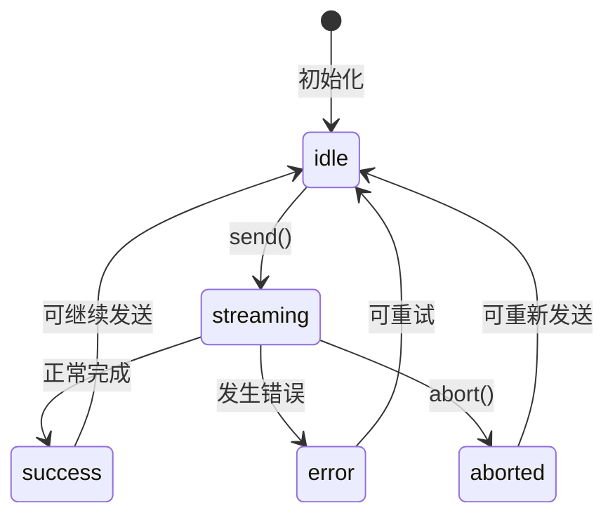

#### 核心代码

```typescript
export class ConversationRuntime {
  private readonly conversation = new ConversationEngine();
  private readonly events = new EventBus<ConversationRuntimeEvents>();
  readonly runtimeEvents = new RuntimeEventBus();
  private controller: AbortController | null = null;

  constructor(private readonly chatProvider: ChatProvider) {}

  async send(content: string): Promise<Message> {
    this.controller = new AbortController();

    // 1. 创建用户消息
    const userMessage = createMessage("user", content);
    this.conversation.addMessage(userMessage);

    // 2. 触发 start 事件
    this.events.emit("start", { message: userMessage });

    try {
      // 3. 调用 Provider
      const result = this.chatProvider.stream
        ? await this.sendWithStream(this.controller.signal)
        : await this.chatProvider.chat({
            messages: this.conversation.getMessages(),
            signal: this.controller.signal
          });

      // 4. 创建助手消息
      const assistantMessage = createMessage("assistant", result.text, "success");
      this.conversation.addMessage(assistantMessage);

      // 5. 触发 complete 事件
      this.events.emit("complete", { message: assistantMessage });

      return assistantMessage;
    } catch (error) {
      // 6. 错误处理
      this.events.emit("error", { error });
      throw error;
    }
  }

  abort(): void {
    this.controller?.abort();
    this.events.emit("abort");
  }
}
```

### 5.4 WorkflowRuntime - 工作流运行时

#### 职责
- 管理 Workflow 完整生命周期
- 协调 WorkflowEngine 执行步骤
- 支持步骤级重试
- 维护 Workflow 状态

#### 核心代码

```typescript
export class WorkflowRuntime {
  readonly conversation = new ConversationEngine();
  readonly parser = new PromptParser();
  readonly providers = new ProviderRegistry();
  readonly runtimeEvents = new RuntimeEventBus();

  async runPrompt(prompt: string, options?: { attachments?: string[] }): Promise<{
    messages: Message[];
    steps: WorkflowStep[];
  }> {
    // 1. 解析 Prompt 为步骤
    const analyzedSteps = await this.analyzePrompt(prompt);

    // 2. 初始化步骤状态
    const steps = analyzedSteps.map((step, index) => ({
      id: `step-${index + 1}`,
      type: step.type,
      title: `Step ${index + 1}`,
      prompt: step.prompt,
      status: "waiting" as const
    }));

    // 3. 触发 start 事件
    this.events.emit("start", { state: this.state });

    // 4. 创建 WorkflowEngine 并执行
    const engine = new WorkflowEngine({
      ...this.providers.get(),
      getProviderForStep: (type) => this.providers.getProviderForStep(type)
    });

    const result = await engine.execute(steps, {
      signal: controller.signal,
      attachments: options?.attachments,
      onStepStart: (step) => {
        this.updateStep(step);
        this.events.emit("stepStart", { step, state: this.state });
      },
      onStepSuccess: (step) => {
        this.updateStep(step);
        this.events.emit("stepSuccess", { step, state: this.state });
      },
      onStepError: (step, error) => {
        this.updateStep(step);
        this.events.emit("stepError", { step, error, state: this.state });
      }
    });

    // 5. 完成处理
    this.events.emit("complete", { state: this.state });
    return result;
  }

  // 步骤重试
  async retryStep(stepId: string): Promise<WorkflowStep> {
    const failedStep = this.state.steps.find(step => step.id === stepId);
    const engine = new WorkflowEngine({ ... });
    const result = await engine.execute([{ ...failedStep, status: "waiting" }]);
    return result.steps[0];
  }

  abort(): void {
    this.controller?.abort();
  }
}
```

### 5.5 WorkflowEngine - 工作流引擎

#### 职责
- 执行 Workflow 步骤
- 状态机管理
- Provider 调用
- 错误处理和传播

#### 执行流程

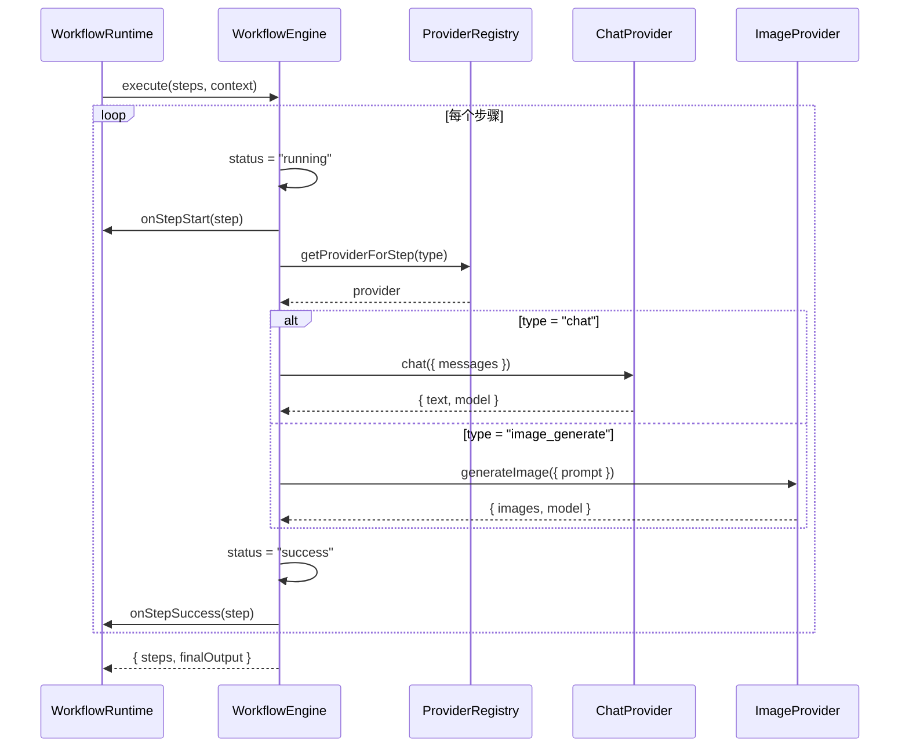

### 5.6 ProviderConfigManager - Provider 配置中心

#### 职责
- 管理 Provider 配置（API Key、Endpoint、Model 等）
- 支持运行时配置更新
- 配置隔离和安全性

#### 核心代码

```typescript
export interface ProviderConfig {
  provider: string;
  apiKey?: string;
  baseUrl?: string;
  model?: string;
  options?: Record<string, unknown>;
}

export class ProviderConfigManager {
  private configs = new Map<string, ProviderConfig>();

  registerConfig(config: ProviderConfig): void {
    this.configs.set(config.provider, { ...config });
  }

  getConfig(provider: string): ProviderConfig | undefined {
    const config = this.configs.get(provider);
    return config ? { ...config } : undefined;
  }

  setConfig(provider: string, config: Partial<ProviderConfig>): void {
    const current = this.configs.get(provider) ?? { provider };
    this.configs.set(provider, { ...current, ...config });
  }
}
```

### 5.7 RuntimeEventBus - 运行时事件总线

#### 职责
- 提供类型安全的事件发布/订阅
- 支持跨组件/跨层通信
- 支持一次性事件监听

#### 核心代码

```typescript
export class RuntimeEventBus {
  private handlers = new Map<RuntimeEventName, Set<(payload: unknown) => void>>();

  on<TKey extends RuntimeEventName>(
    event: TKey,
    handler: (payload: RuntimeEventPayloadMap[TKey]) => void
  ): () => void {
    const handlers = this.handlers.get(event) ?? new Set();
    handlers.add(handler as (payload: unknown) => void);
    this.handlers.set(event, handlers);

    // 返回取消订阅函数
    return () => this.off(event, handler);
  }

  once<TKey extends RuntimeEventName>(
    event: TKey,
    handler: (payload: RuntimeEventPayloadMap[TKey]) => void
  ): () => void {
    const off = this.on(event, (payload) => {
      off();
      handler(payload);
    });
    return off;
  }

  emit<TKey extends RuntimeEventName>(
    event: TKey,
    payload: RuntimeEventPayloadMap[TKey]
  ): void {
    this.handlers.get(event)?.forEach(handler => handler(payload));
  }
}
```

---

## 第六部分：Provider 系统

### 6.1 Provider 架构概览

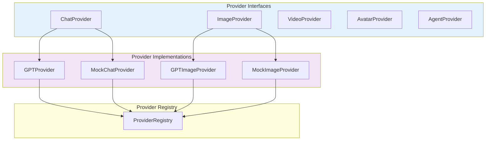

### 6.2 Provider 接口定义

#### 6.2.1 ChatProvider

```typescript
export interface ChatProvider {
  // 基础聊天
  chat(input: {
    messages: Message[];
    signal?: AbortSignal;
  }): Promise<{ text: string; model: string }>;

  // 可选：流式输出
  stream?(input: {
    messages: Message[];
    signal?: AbortSignal;
  }): AsyncIterable<ChatStreamChunk>;

  // 可选：Prompt 优化
  optimizePrompt?(input: {
    prompt: string;
    signal?: AbortSignal;
  }): Promise<{ prompt: string; model: string }>;

  // 可选：Workflow 分析
  analyzeWorkflow?(input: {
    prompt: string;
    signal?: AbortSignal;
  }): Promise<{ steps: Array<{ type: WorkflowStepType; prompt: string }>; model: string }>;

  // 能力声明
  getCapability?(): ProviderCapability;

  // 元数据
  getMetadata?(): ProviderMetadata;
}
```

#### 6.2.2 ImageProvider

```typescript
export interface ImageProvider {
  // 图像生成
  generateImage(input: {
    prompt: string;
    attachments?: string[];
    signal?: AbortSignal;
  }): Promise<{ images: string[]; model: string }>;

  // 可选：图像编辑
  editImage?(input: {
    prompt: string;
    attachments: string[];
    signal?: AbortSignal;
  }): Promise<{ images: string[]; model: string }>;

  getCapability?(): ProviderCapability;
  getMetadata?(): ProviderMetadata;
}
```

### 6.3 Provider 注册机制

```typescript
// 1. 创建 Provider 实例
const chatProvider = new GPTProvider({
  apiKey: "sk-...",
  baseUrl: "https://api.openai.com/v1",
  model: "gpt-5.5"
});

// 2. 注册到 Registry
const registry = new ProviderRegistry();
registry.registerProvider("chat", chatProvider);

// 3. 也可以批量注册
registry.register({
  chat: chatProvider,
  image: imageProvider,
  video: videoProvider
});
```

### 6.4 Provider 查找机制

```typescript
// 按类型查找
const chatProvider = registry.getProvider("chat");

// 按步骤类型自动匹配
const provider = registry.getProviderForStep("image_generate");
// 优先返回声明支持 image_generate 的 ImageProvider

// 列出所有能力
const capabilities = registry.listCapabilities();
// [
//   { provider: "gpt-5.5", supports: ["chat"], streaming: true, ... },
//   { provider: "gpt-image-2", supports: ["image_generate", "image_edit"], ... }
// ]
```

### 6.5 Provider Metadata 机制

```typescript
export const GPT_PROVIDER_METADATA: ProviderMetadata = {
  id: "gpt-5.5",
  name: "GPT 5.5",
  description: "OpenAI GPT 5.5 模型，支持多模态输入和流式输出",
  icon: "🤖",
  website: "https://openai.com",
  category: "chat",
  status: "stable",
  pricing: "https://openai.com/pricing",
  tags: ["multimodal", "streaming", "reasoning"]
};

// 在 Provider 中实现
class GPTProvider implements ChatProvider {
  getMetadata(): ProviderMetadata {
    return GPT_PROVIDER_METADATA;
  }
}
```

### 6.6 新增 Provider 的标准流程

#### 步骤 1：定义 Provider 类

```typescript
// packages/providers/src/chat/MyProvider.ts
import type { ChatProvider, ProviderCapability, ProviderMetadata } from "../types";

export class MyProvider implements ChatProvider {
  constructor(private config: { apiKey: string; baseUrl: string }) {}

  async chat(input: { messages: Message[]; signal?: AbortSignal }) {
    // 实现 API 调用
    const response = await fetch(`${this.config.baseUrl}/chat`, {
      headers: { Authorization: `Bearer ${this.config.apiKey}` },
      body: JSON.stringify({ messages: input.messages })
    });

    const data = await response.json();
    return { text: data.content, model: "my-model" };
  }

  getCapability(): ProviderCapability {
    return {
      provider: "my-provider",
      supports: ["chat"],
      streaming: false,
      configurable: true
    };
  }

  getMetadata(): ProviderMetadata {
    return {
      id: "my-provider",
      name: "My Provider",
      category: "chat",
      status: "beta"
    };
  }
}
```

#### 步骤 2：导出 Provider

```typescript
// packages/providers/src/index.ts
export { MyProvider } from "./chat/MyProvider";
```

#### 步骤 3：注册并使用

```typescript
import { MyProvider } from "@company/ai-composer-providers";

const registry = new ProviderRegistry();
registry.registerProvider("chat", new MyProvider({
  apiKey: "...",
  baseUrl: "https://api.my-provider.com"
}));
```

---

## 第七部分：ConversationRuntime

### 7.1 运行流程

```mermaid
sequenceDiagram
    participant UI as React UI
    participant CR as ConversationRuntime
    participant CE as ConversationEngine
    participant CP as ChatProvider
    participant API as OpenAI API

    UI->>CR: send("Hello")
    CR->>CE: addMessage(userMessage)
    CR->>UI: emit("start", { message })
    CR->>UI: emit("message", { message })

    alt Provider 支持 stream
        CR->>CP: stream({ messages, signal })
        loop 每个 chunk
            API-->>CP: { content, done }
            CP-->>CR: AsyncIterable
            CR->>UI: emit("streaming", { message })
        end
    else Provider 不支持 stream
        CR->>CP: chat({ messages, signal })
        API-->>CP: { text, model }
        CP-->>CR: { text, model }
    end

    CR->>CE: addMessage(assistantMessage)
    CR->>UI: emit("complete", { message })
    CR-->>UI: Promise<Message>
```

### 7.2 消息生命周期

```
┌─────────┐    ┌─────────────┐    ┌──────────┐    ┌──────────┐
│  User   │───→│   Pending   │───→│Streaming │───→│ Success  │
│  Input  │    │ (等待发送)  │    │ (流式中)  │    │ (完成)   │
└─────────┘    └─────────────┘    └──────────┘    └──────────┘
                          │
                          ↓
                   ┌──────────┐
                   │  Error   │
                   │ (失败)   │
                   └──────────┘
                          ↑
                   ┌──────────┐
                   │ Aborted  │
                   │ (已中断) │
                   └──────────┘
```

### 7.3 Streaming 流程详解

```typescript
private async sendWithStream(signal: AbortSignal): Promise<{ text: string; model: string }> {
  let text = "";
  const streamingMessage: Message = {
    id: `assistant-stream-${Date.now()}`,
    role: "assistant",
    content: "",
    createdAt: Date.now(),
    status: "streaming"
  };

  // 遍历异步可迭代对象
  for await (const chunk of this.chatProvider.stream?.({
    messages: this.conversation.getMessages(),
    signal
  }) ?? []) {
    text += chunk.content;
    streamingMessage.content = text;

    // 实时更新 UI
    this.events.emit("streaming", { message: { ...streamingMessage } });

    if (chunk.done) break;
  }

  return { text, model: this.chatProvider.getCapability?.().provider ?? "stream" };
}
```

### 7.4 Abort 流程

```typescript
// 1. 用户触发中断
function handleStop() {
  runtime.abort();
}

// 2. Runtime 内部处理
abort(): void {
  // 触发 AbortController
  this.controller?.abort();

  // 更新状态
  this.state = { ...this.state, status: "aborted" };

  // 通知订阅者
  this.events.emit("abort");
}

// 3. Provider 层响应中断
async chat(input: { messages: Message[]; signal?: AbortSignal }) {
  const response = await fetch(url, {
    signal: input.signal  // 将 AbortSignal 传递给 fetch
  });
  // 当 abort() 被调用时，fetch 会抛出 AbortError
}
```

### 7.5 Error 流程

```typescript
try {
  const result = await this.chatProvider.chat({ ... });
  // ... 正常处理
} catch (error) {
  const runtimeError = error instanceof Error
    ? error
    : new Error("Conversation request failed.");

  // 判断是否为中断错误
  const isAborted = this.controller.signal.aborted;

  this.state = {
    status: isAborted ? "aborted" : "error",
    messages: this.conversation.getMessages(),
    error: runtimeError.message
  };

  // 分发错误事件
  if (isAborted) {
    this.events.emit("abort");
  } else {
    this.events.emit("error", { error: runtimeError });
  }

  throw runtimeError;
}
```

### 7.6 事件触发机制

| 事件 | 触发时机 |  payload |
|------|----------|----------|
| `start` | 开始发送用户消息 | `{ message: Message }` |
| `message` | 新消息添加 | `{ message: Message }` |
| `streaming` | 流式输出更新 | `{ message: Message }` |
| `complete` | 助手响应完成 | `{ message: Message }` |
| `error` | 发生错误 | `{ error: Error }` |
| `abort` | 用户中断 | `undefined` |

### 7.7 状态流转图

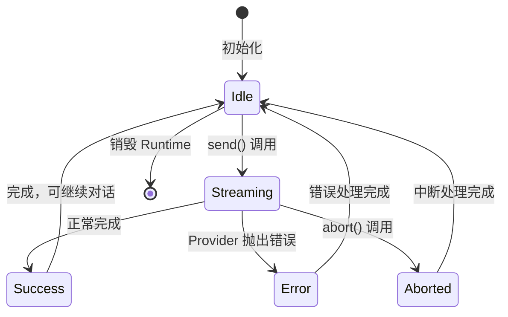

---

## 第八部分：WorkflowRuntime

### 8.1 Workflow 生命周期

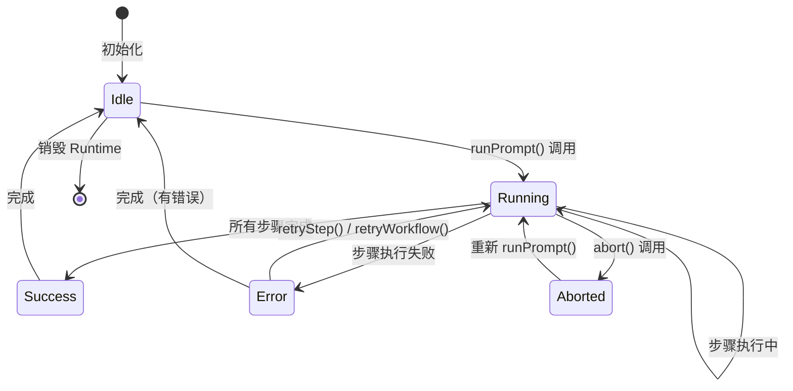

### 8.2 Step 生命周期

```
┌──────────┐    ┌──────────┐    ┌──────────┐    ┌──────────┐
│ Waiting  │───→│ Running  │───→│ Success  ││ Error    │
│ (等待)   │    │ (执行中)  │    │ (成功)   ││ (失败)   │
└──────────┘    └──────────┘    └──────────┘└──────────┘
                      │              ↑
                      └──────────────┘
                        retryStep()
```

### 8.3 Provider 匹配机制

```typescript
getProviderForStep(type: WorkflowStepType): ChatProvider | ImageProvider | ... {
  // 1. 优先检查 ImageProvider 是否支持
  if (this.state.image?.getCapability?.().supports.includes(type)) {
    return this.state.image;
  }

  // 2. 检查 ChatProvider 是否支持（如 GPT-4o 支持图像生成）
  if (this.state.chat?.getCapability?.().supports.includes(type)) {
    return this.state.chat;
  }

  // 3. 按类型默认匹配
  if (type === "video_generate" || type === "image_to_video") {
    return this.state.video;
  }

  if (type === "agent_task") {
    return this.state.agent;
  }

  return undefined;
}
```

### 8.4 Retry 机制

```typescript
// Workflow 级别重试
retryWorkflow(): Promise<{ messages: Message[]; steps: WorkflowStep[] }> {
  if (!this.lastInput) {
    throw new Error("No workflow is available to retry.");
  }
  // 使用相同的 prompt 和 attachments 重新执行
  return this.runPrompt(this.lastInput.prompt, {
    attachments: this.lastInput.attachments
  });
}

// 步骤级别重试
async retryStep(stepId: string): Promise<WorkflowStep> {
  const failedStep = this.state.steps.find(step => step.id === stepId);

  if (!failedStep) {
    throw new Error(`Workflow step "${stepId}" was not found.`);
  }

  // 重置步骤状态并重新执行
  const engine = new WorkflowEngine({ ... });
  const result = await engine.execute([{
    ...failedStep,
    status: "waiting",
    output: undefined,
    error: undefined
  }]);

  return result.steps[0];
}
```

### 8.5 Abort 机制

```typescript
abort(): void {
  // 1. 触发 AbortController
  this.controller?.abort();

  // 2. 更新状态
  this.state = {
    ...this.state,
    status: "aborted",
    completedAt: Date.now()
  };

  // 3. 通知所有订阅者
  this.events.emit("abort", { state: this.state });
}
```

### 8.6 Workflow 状态管理

```typescript
export interface WorkflowRuntimeState {
  status: WorkflowRuntimeStatus;    // "idle" | "running" | "success" | "error" | "aborted"
  steps: WorkflowStep[];            // 当前所有步骤
  messages: Message[];              // 关联的对话消息
  error?: string;                   // 错误信息
  startedAt?: number;               // 开始时间
  completedAt?: number;             // 完成时间
}

// 状态更新是 Immutable 的
private updateStep(step: WorkflowStep): void {
  this.state = {
    ...this.state,
    steps: this.state.steps.map(item =>
      item.id === step.id ? step : item
    )
  };
}
```

---

## 第九部分：Streaming 架构

### 9.1 当前 Streaming 架构设计

```mermaid
graph LR
    subgraph "Provider Layer"
        CP[ChatProvider]
        Stream[stream() 方法]
    end

    subgraph "Runtime Layer"
        CR[ConversationRuntime]
        SWS[sendWithStream()]
    end

    subgraph "UI Layer"
        Handler[onStreaming Handler]
        State[React State]
    end

    CP -->|实现| Stream
    Stream -->|AsyncIterable| SWS
    SWS -->|emit streaming| Handler
    Handler -->|setState| State
```

### 9.2 stream() vs chat()

| 特性 | `chat()` | `stream()` |
|------|----------|------------|
| 返回值 | `Promise<{ text, model }>` | `AsyncIterable<ChatStreamChunk>` |
| 实时性 | 等待完整响应 | 实时输出 |
| 实现复杂度 | 简单 | 需要支持流式解析 |
| Provider 支持 | 必须实现 | 可选实现 |
| 适用场景 | 短文本、快速响应 | 长文本、需要实时反馈 |

### 9.3 兼容机制

```typescript
// ConversationRuntime 自动检测并选择最佳方式
async send(content: string): Promise<Message> {
  const result = this.chatProvider.stream
    ? await this.sendWithStream(this.controller.signal)  // 优先使用流式
    : await this.chatProvider.chat({                    // 回退到非流式
        messages: this.conversation.getMessages(),
        signal: this.controller.signal
      });
  // ...
}
```

### 9.4 回退机制

```typescript
// 如果 Provider 没有实现 stream() 方法
// Runtime 会自动回退到 chat() 方法
// 用户无需关心 Provider 是否支持流式
```

### 9.5 未来真实 Token Streaming 规划

```typescript
// 未来扩展：支持 SSE / WebSocket 真实流式
export interface StreamingProvider {
  // 当前：模拟流式（一次性返回分块）
  stream?(input: { messages: Message[] }): AsyncIterable<ChatStreamChunk>;

  // 未来：真实 SSE 流式
  streamSSE?(input: { messages: Message[] }): EventSource;

  // 未来：WebSocket 流式
  streamWebSocket?(input: { messages: Message[] }): WebSocket;
}
```

---

## 第十部分：Provider Config Center

### 10.1 ProviderConfigManager 职责

- 集中管理所有 Provider 的配置
- 支持运行时动态更新配置
- 配置隔离，确保安全

### 10.2 配置来源

```
┌─────────────────────────────────────────────────────────────┐
│                     配置来源优先级                           │
├─────────────────────────────────────────────────────────────┤
│ 1. 代码中硬编码的默认配置                                    │
│ 2. 环境变量 (.env)                                          │
│ 3. 运行时通过 ProviderConfigManager 设置                   │
│ 4. 用户界面配置（未来）                                      │
└─────────────────────────────────────────────────────────────┘
```

### 10.3 配置生命周期

```typescript
// 1. 创建 Manager
const configManager = new ProviderConfigManager();

// 2. 注册配置
configManager.registerConfig({
  provider: "openai",
  apiKey: "sk-...",
  baseUrl: "https://api.openai.com/v1",
  model: "gpt-5.5"
});

// 3. 获取配置
const config = configManager.getConfig("openai");

// 4. 更新配置（部分更新）
configManager.setConfig("openai", {
  model: "gpt-5.5-preview"  // 只更新 model
});

// 5. 删除配置
configManager.removeConfig("openai");
```

### 10.4 开发环境配置

```bash
# .env
VITE_GPT_API_KEY=sk-your-api-key
VITE_GPT_BASE_URL=https://api.openai.com/v1
VITE_GPT_CHAT_MODEL=gpt-5.5
VITE_GPT_IMAGE_MODEL=gpt-image-2
```

### 10.5 生产环境配置

```typescript
// 推荐：从安全的配置服务获取
const config = await fetchConfigFromService();

configManager.registerConfig({
  provider: "openai",
  apiKey: config.apiKey,  // 从安全服务获取
  baseUrl: config.baseUrl,
  model: config.model
});
```

### 10.6 推荐实践

- 不要在代码中硬编码 API Key
- 使用环境变量或配置服务
- 配置变更时重新初始化 Provider
- 敏感配置存储在服务端

---

## 第十一部分：Runtime Event Bus

### 11.1 RuntimeEventBus 职责

- 提供类型安全的事件系统
- 支持跨层通信（Core → UI）
- 支持事件的订阅和取消订阅

### 11.2 支持事件

| 事件名称 | 触发时机 | Payload |
|----------|----------|---------|
| `workflow:start` | Workflow 开始执行 | `{ state: WorkflowRuntimeState }` |
| `workflow:complete` | Workflow 完成 | `{ state: WorkflowRuntimeState }` |
| `workflow:error` | Workflow 出错 | `{ error, state }` |
| `step:start` | 步骤开始执行 | `{ step, state }` |
| `step:success` | 步骤成功完成 | `{ step, state }` |
| `step:error` | 步骤执行失败 | `{ step, error, state }` |
| `conversation:start` | 对话开始 | `{ message }` |
| `conversation:message` | 新消息 | `{ message }` |
| `conversation:complete` | 对话完成 | `{ message }` |

### 11.3 事件订阅机制

```typescript
const runtime = new WorkflowRuntime();

// 订阅事件
const unsubscribe = runtime.runtimeEvents.on("step:success", ({ step, state }) => {
  console.log(`Step ${step.title} completed!`);
  console.log(`Current state:`, state);
});

// 取消订阅
unsubscribe();
```

### 11.4 事件发布机制

```typescript
// 在 Runtime 内部发布事件
this.runtimeEvents.emit("step:success", {
  step: runningStep,
  state: this.state
});
```

### 11.5 最佳实践

```typescript
// 1. 使用 useEffect 管理订阅
useEffect(() => {
  const unsubscribe = runtime.runtimeEvents.on("step:success", handler);
  return () => unsubscribe();  // 清理订阅
}, []);

// 2. 一次性事件监听
runtime.runtimeEvents.once("workflow:complete", ({ state }) => {
  console.log("Workflow completed!", state);
});

// 3. 避免内存泄漏：始终取消订阅
// 4. 不要在事件处理器中直接修改状态
// 5. 使用类型安全的事件名称和 payload
```

---

## 第十二部分：Workflow DAG 设计

### 12.1 当前状态

当前 Workflow 支持**线性执行**，暂不支持 DAG（有向无环图）。

```
当前：线性 Workflow

Step 1 ──→ Step 2 ──→ Step 3 ──→ Step 4

未来：DAG Workflow

       ┌──→ Step 2 ──┐
Step 1 ─┤             ├──→ Step 5
       └──→ Step 3 ──→ Step 4 ──┘
```

### 12.2 WorkflowNode / WorkflowEdge 定义

```typescript
// 已定义但未完全实现
export interface WorkflowNode {
  id: string;
  type: WorkflowStepType;
}

export interface WorkflowEdge {
  source: string;
  target: string;
}

export interface WorkflowGraph {
  nodes: WorkflowNode[];
  edges: WorkflowEdge[];
}
```

### 12.3 为什么只设计未实现

1. **当前需求**：Phase-01 到 Phase-05 主要关注单轮对话和线性工作流
2. **复杂度**：DAG 执行需要拓扑排序、并行执行调度、依赖管理
3. **优先级**：先完善基础能力，再扩展复杂场景

### 12.4 未来演进方向

```typescript
// 未来：支持 DAG 的 WorkflowEngine
class WorkflowEngine {
  async executeGraph(
    graph: WorkflowGraph,
    context: WorkflowEngineContext
  ): Promise<WorkflowExecutionResult> {
    // 1. 拓扑排序
    const sorted = topologicalSort(graph);

    // 2. 并行执行无依赖的节点
    const executed = new Map<string, WorkflowStep>();

    for (const batch of groupByLevel(sorted)) {
      // 并行执行同一层的节点
      const results = await Promise.all(
        batch.map(node => this.executeNode(node, context, executed))
      );
      results.forEach(result => executed.set(result.id, result));
    }

    return { steps: Array.from(executed.values()) };
  }
}
```

---

## 第十三部分：React 层

### 13.1 当前组件结构

```
React Layer
│
├── components/                    # UI 组件
│   ├── AiComposer.tsx            # 输入层组件
│   ├── ConversationView.tsx      # 展示层组件
│   ├── WorkflowTimeline.tsx      # 工作流展示组件
│   ├── AgentConversationWorkspace.tsx  # 组合层组件
│   └── ...                       # 其他子组件
│
├── controllers/                  # 控制器
│   └── useAgentConversationController.ts
│
├── core/                         # React 层 Core 适配
│   ├── ComposerCore.ts
│   ├── types.ts
│   └── ...
│
└── plugins/                      # React 层插件
    ├── CommandPlugin.ts
    ├── MentionPlugin.ts
    └── UploadPlugin.ts
```

### 13.2 组件依赖关系

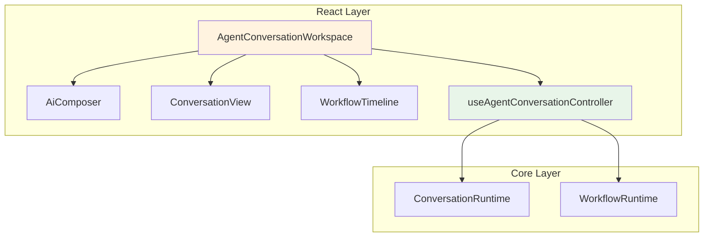

### 13.3 职责边界

| 组件 | 职责 | 禁止 |
|------|------|------|
| **AiComposer** | 文本输入、附件上传、命令/提及交互 | 禁止直接调用 API |
| **ConversationView** | 消息渲染、Markdown 解析 | 禁止修改消息状态 |
| **WorkflowTimeline** | 步骤状态展示 | 禁止执行 Workflow |
| **AgentConversationWorkspace** | 布局组合、状态连接 | 禁止包含业务逻辑 |
| **useAgentConversationController** | 连接 UI 和 Runtime | 禁止直接渲染 |

### 13.4 未来拆分方向

```
当前：useAgentConversationController 包含过多逻辑

未来拆分：

┌─────────────────────────────────────────────────────┐
│           useAgentConversationController            │
├─────────────────────────────────────────────────────┤
│  ┌─────────────────┐  ┌─────────────────────────┐  │
│  │ useConversation │  │ useWorkflow             │  │
│  │ - 对话管理      │  │ - 工作流管理            │  │
│  │ - 消息状态      │  │ - 步骤状态              │  │
│  └─────────────────┘  └─────────────────────────┘  │
│  ┌─────────────────┐  ┌─────────────────────────┐  │
│  │ useProvider     │  │ useCache                │  │
│  │ - Provider 配置 │  │ - 本地缓存              │  │
│  └─────────────────┘  └─────────────────────────┘  │
└─────────────────────────────────────────────────────┘
```

---

## 第十四部分：Playground

### 14.1 RuntimePlayground

**作用**：验证 Core 层功能

```typescript
// 独立测试 Runtime 功能
const runtime = new ConversationRuntime(mockChatProvider);

runtime.onMessage(({ message }) => {
  console.log("New message:", message);
});

await runtime.send("Hello, AI!");
```

### 14.2 Mock Provider

**作用**：不依赖真实 API，快速验证功能

```typescript
// MockChatProvider
class MockChatProvider implements ChatProvider {
  async chat(input: { messages: Message[] }) {
    const lastMessage = [...input.messages]
      .reverse()
      .find(m => m.role === "user");

    return {
      text: `Mock response: ${lastMessage?.content}`,
      model: "mock-chat"
    };
  }
}
```

### 14.3 GPT Provider

**作用**：连接真实 OpenAI API

```typescript
const provider = new GPTProvider({
  apiKey: import.meta.env.VITE_GPT_API_KEY,
  baseUrl: "https://api.openai.com/v1",
  model: "gpt-5.5"
});
```

### 14.4 使用方式

```bash
# 启动 Playground
pnpm dev

# 访问 http://localhost:4175/
# 切换不同演示：chat-demo / image-demo / workspace / gpt / runtime
```

### 14.5 调试方式

```typescript
// 1. 查看 Runtime 事件
runtime.runtimeEvents.on("step:start", ({ step }) => {
  debugger;  // 断点调试
});

// 2. 查看状态变化
console.log(runtime.getState());

// 3. 使用 React DevTools 查看组件状态
```

---

## 第十五部分：完整运行流程

### 15.1 时序图：一次 Chat 请求

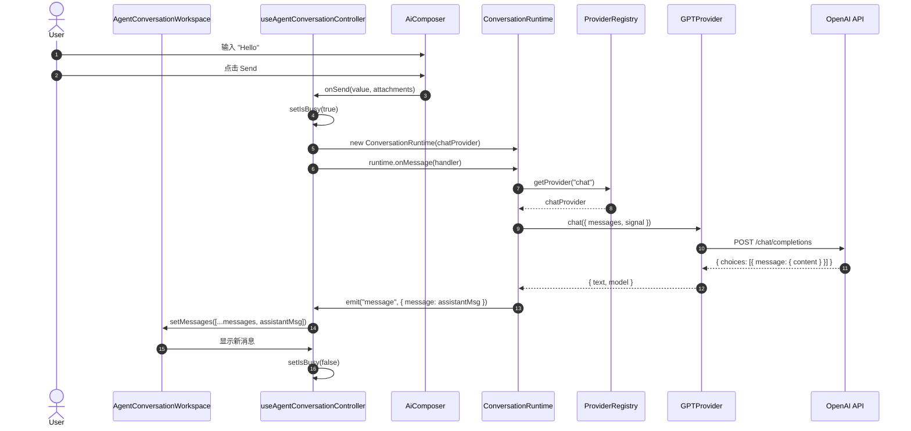

### 15.2 时序图：一次 Workflow 请求

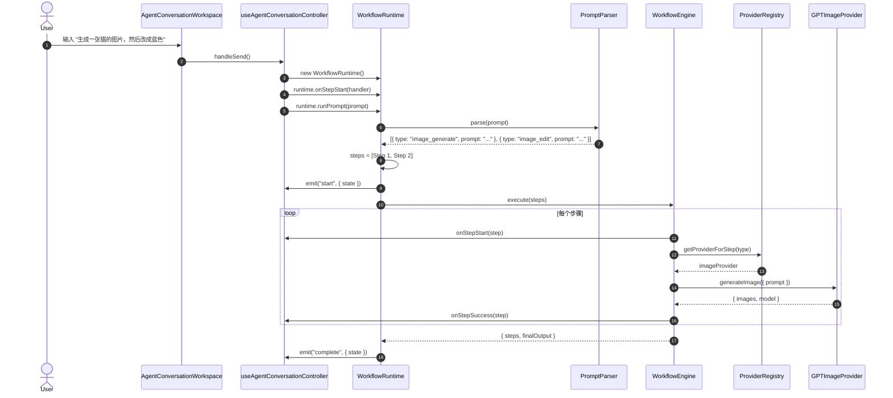

---

## 第十六部分：扩展指南

### 16.1 新增 Chat Provider

#### 步骤 1：创建 Provider 文件

```typescript
// packages/providers/src/chat/ClaudeProvider.ts
import type { ChatProvider, ChatStreamChunk, ProviderCapability, ProviderMetadata } from "../types";
import type { Message } from "@company/ai-composer-shared";

export interface ClaudeProviderConfig {
  apiKey: string;
  baseUrl?: string;
  model?: string;
}

export class ClaudeProvider implements ChatProvider {
  private readonly config: Required<ClaudeProviderConfig>;

  constructor(config: ClaudeProviderConfig) {
    this.config = {
      baseUrl: "https://api.anthropic.com/v1",
      model: "claude-3-opus-20240229",
      ...config
    };
  }

  async chat(input: { messages: Message[]; signal?: AbortSignal }): Promise<{ text: string; model: string }> {
    const response = await fetch(`${this.config.baseUrl}/messages`, {
      method: "POST",
      headers: {
        "Content-Type": "application/json",
        "x-api-key": this.config.apiKey,
        "anthropic-version": "2023-06-01"
      },
      body: JSON.stringify({
        model: this.config.model,
        max_tokens: 4096,
        messages: input.messages.map(m => ({
          role: m.role === "user" ? "user" : "assistant",
          content: m.content
        }))
      }),
      signal: input.signal
    });

    if (!response.ok) {
      throw new Error(`Claude API error: ${response.status}`);
    }

    const data = await response.json();
    return {
      text: data.content[0].text,
      model: this.config.model
    };
  }

  getCapability(): ProviderCapability {
    return {
      provider: "claude",
      supports: ["chat"],
      inputTypes: ["text"],
      outputTypes: ["text"],
      streaming: false,
      configurable: true
    };
  }

  getMetadata(): ProviderMetadata {
    return {
      id: "claude-3-opus",
      name: "Claude 3 Opus",
      description: "Anthropic's most capable model",
      category: "chat",
      status: "stable"
    };
  }
}
```

#### 步骤 2：导出 Provider

```typescript
// packages/providers/src/index.ts
export { ClaudeProvider } from "./chat/ClaudeProvider";
```

#### 步骤 3：注册并使用

```typescript
import { ClaudeProvider } from "@company/ai-composer-providers";

const registry = new ProviderRegistry();
registry.registerProvider("chat", new ClaudeProvider({
  apiKey: "sk-ant-..."
}));

const runtime = new ConversationRuntime(registry.getProvider("chat")!);
```

### 16.2 新增 Image Provider

```typescript
// packages/providers/src/image/FluxProvider.ts
export class FluxProvider implements ImageProvider {
  async generateImage(input: { prompt: string; signal?: AbortSignal }) {
    // 调用 Flux API
    const response = await fetch("https://api.bfl.ml/v1/flux-pro", {
      method: "POST",
      headers: { "Content-Type": "application/json" },
      body: JSON.stringify({ prompt: input.prompt }),
      signal: input.signal
    });

    const data = await response.json();
    return {
      images: [data.image_url],
      model: "flux-pro"
    };
  }

  getCapability(): ProviderCapability {
    return {
      provider: "flux",
      supports: ["image_generate"],
      inputTypes: ["text"],
      outputTypes: ["image"]
    };
  }
}
```

### 16.3 新增 Video Provider

```typescript
// packages/providers/src/video/KelingProvider.ts
export class KelingProvider implements VideoProvider {
  async generateVideo(input: { prompt: string; signal?: AbortSignal }) {
    // 调用可灵 API
    const response = await fetch("https://api.klingai.com/v1/videos", {
      method: "POST",
      headers: { Authorization: `Bearer ${this.apiKey}` },
      body: JSON.stringify({ prompt: input.prompt })
    });

    // 轮询获取结果
    const videoUrl = await pollVideoResult(response.id);

    return {
      videos: [videoUrl],
      model: "kling-v1"
    };
  }

  getCapability(): ProviderCapability {
    return {
      provider: "kling",
      supports: ["video_generate", "image_to_video"],
      inputTypes: ["text", "image"],
      outputTypes: ["video"]
    };
  }
}
```

### 16.4 新增 Provider 标准流程总结

| 步骤 | 操作 | 文件位置 |
|------|------|----------|
| 1 | 创建 Provider 类 | `packages/providers/src/{category}/{Name}Provider.ts` |
| 2 | 实现接口方法 | chat / generateImage / generateVideo 等 |
| 3 | 实现 getCapability() | 声明支持的步骤类型和能力 |
| 4 | 实现 getMetadata() | 提供 Provider 元数据 |
| 5 | 导出 Provider | `packages/providers/src/index.ts` |
| 6 | 注册并使用 | 在应用代码中实例化和注册 |
| 7 | 编写测试 | `packages/providers/src/{category}/{Name}Provider.test.ts` |

---

## 第十七部分：开发规范

### 17.1 代码规范

#### 命名规范

| 类型 | 规范 | 示例 |
|------|------|------|
| 类名 | PascalCase | `ConversationRuntime`, `GPTProvider` |
| 接口 | PascalCase 前缀 I 可选 | `ChatProvider`, `IConfig` |
| 类型别名 | PascalCase | `Message`, `WorkflowStep` |
| 函数 | camelCase | `send()`, `generateImage()` |
| 变量 | camelCase | `conversation`, `apiKey` |
| 常量 | SNAKE_CASE | `DEFAULT_TIMEOUT`, `STORAGE_KEY` |
| 枚举 | PascalCase | `ComposerPhase`, `WorkflowStatus` |

#### 目录规范

```
packages/{package}/src/
├── index.ts              # 统一导出
├── {Component}.ts        # 主要实现
├── {Component}.test.ts   # 单元测试
├── types.ts            # 类型定义（如有）
├── {category}/           # 分类目录
│   └── {Name}.ts
└── utils/              # 工具函数
```

### 17.2 类型规范

```typescript
// ✅ 显式声明返回类型
async function sendMessage(content: string): Promise<Message> {
  // ...
}

// ✅ 使用 strict TypeScript 配置
// tsconfig.json: "strict": true

// ✅ 避免 any
function process(data: unknown): void {
  // 使用类型守卫
  if (isMessage(data)) {
    // data 被推断为 Message
  }
}

// ❌ 禁止使用 any
function bad(data: any): any {  // ← 禁止
  return data;
}
```

### 17.3 测试规范

```typescript
// ✅ 使用 vitest
import { describe, it, expect, vi } from "vitest";

// ✅ 测试文件名: {Name}.test.ts
// ✅ 测试覆盖率要求: 核心功能 > 80%

describe("ConversationRuntime", () => {
  it("should send message successfully", async () => {
    const mockProvider = {
      chat: vi.fn().mockResolvedValue({ text: "Hello", model: "gpt-5.5" })
    };

    const runtime = new ConversationRuntime(mockProvider);
    const message = await runtime.send("Hi");

    expect(message.content).toBe("Hello");
    expect(message.role).toBe("assistant");
  });

  it("should handle abort", async () => {
    // ... 测试中断逻辑
  });
});
```

### 17.4 Provider 规范

```typescript
// ✅ 必须实现接口
export class MyProvider implements ChatProvider {
  // ✅ 必须实现核心方法
  async chat(input: { messages: Message[] }): Promise<{ text: string; model: string }> {
    // 实现
  }

  // ✅ 实现能力声明
  getCapability(): ProviderCapability {
    return {
      provider: "my-provider",
      supports: ["chat"],
      streaming: false,  // 明确声明是否支持
      configurable: true
    };
  }

  // ✅ 实现元数据
  getMetadata(): ProviderMetadata {
    return {
      id: "my-provider",
      name: "My Provider",
      category: "chat",
      status: "stable"  // stable | beta | experimental
    };
  }
}
```

### 17.5 Runtime 规范

```typescript
// ✅ Runtime 必须支持 Abort
class MyRuntime {
  private controller: AbortController | null = null;

  async execute(): Promise<void> {
    this.controller = new AbortController();

    try {
      await this.doWork(this.controller.signal);
    } catch (error) {
      if (this.controller.signal.aborted) {
        // 处理中断
      }
      throw error;
    }
  }

  abort(): void {
    this.controller?.abort();
  }
}
```

---

## 第十八部分：项目现状

### 18.1 Phase 完成情况

| 阶段 | 状态 | 完成度 | 关键交付 |
|------|------|--------|----------|
| **Phase-01** | ✅ 已完成 | 100% | 基础 AiComposer 组件 |
| **Phase-02** | ✅ 已完成 | 100% | Upload 插件系统 |
| **Phase-03** | ✅ 已完成 | 100% | Mention/Command 系统 |
| **Phase-04** | ✅ 已完成 | 90% | Core Runtime 架构 |
| **Phase-05** | ✅ 已完成 | 85% | 展示层拆分 |

### 18.2 当前能力边界

```
✅ 已实现
├── 基础对话 (Chat)
├── 文件上传 (Upload)
├── Mention / Command
├── Workflow 基础执行
├── Provider 注册机制
├── React 组件库
└── Mock Provider

🚧 部分实现
├── GPT Provider (基础 wrapper)
├── Vue 适配 (基础组件)
└── Workflow Timeline (线性展示)

❌ 未实现
├── 真实 GPT-5.5 Streaming
├── 真实 GPT-Image-2
├── DAG Workflow
├── Video/Audio/Avatar Provider
├── RAG 检索增强
└── Agent 完整实现
```

### 18.3 当前技术债

| 技术债 | 影响 | 计划解决 |
|--------|------|----------|
| 根目录旧 `src/` 未清理 | 维护风险 | Phase-06 |
| Shared 层生成文件混入源码 | 版本控制噪音 | Phase-06 |
| Vue 组件未完成 | 跨框架能力不完整 | Phase-07 |
| Provider 未接真实模型 | 只能演示 | Phase-03 |
| Workflow 仅支持线性 | 复杂工作流受限 | Phase-08 |
| Markdown 渲染基础 | 富文本支持不足 | Phase-07 |

---

## 第十九部分：未来路线图

### 19.1 Phase-06 Workspace Decoupling

- [ ] 清理旧 `src/` 目录
- [ ] 移除生成文件，更新 `.gitignore`
- [ ] 完善 Workspace 控制器拆分
- [ ] 优化 React 组件性能

### 19.2 Phase-07 React Component Library

- [ ] 完整 Markdown 渲染器
- [ ] 消息虚拟列表
- [ ] 图片预览/下载
- [ ] 视频/音频/数字人消息展示
- [ ] Storybook 全覆盖

### 19.3 Phase-08 Vue Adapter

- [ ] 完成 Vue AiComposer
- [ ] 完成 Vue ConversationView
- [ ] 完成 Vue WorkflowTimeline
- [ ] Vue Storybook
- [ ] Vue 单元测试
- [ ] 跨框架行为一致性测试

### 19.4 Phase-09 Video/Audio/Avatar Provider

- [ ] VideoProvider 接口
- [ ] 可灵 Provider 实现
- [ ] Runway Provider 实现
- [ ] AudioProvider 接口
- [ ] AvatarProvider 接口
- [ ] HeyGen Provider 实现

### 19.5 长期规划

```
2026 Q3: GPT-5.5 完整接入, Vue 1.0 发布
2026 Q4: GPT-Image-2, Video Provider
2027 Q1: RAG, Agent 完整实现
2027 Q2: DAG Workflow, 多 Agent 协作
```

---

## 第二十部分：快速上手

### 20.1 启动项目

```bash
# 1. 克隆项目
git clone <repo-url>
cd ai-composer

# 2. 安装依赖
pnpm install

# 3. 配置环境变量
cp .env.example .env
# 编辑 .env，填入你的 API Key

# 4. 启动开发服务器
pnpm dev

# 5. 访问 http://localhost:4175/
```

### 20.2 运行测试

```bash
# 运行所有测试
pnpm test

# 运行特定包的测试
pnpm --filter @company/ai-composer-core test
pnpm --filter @company/ai-composer-providers test

# 运行带覆盖率
pnpm --filter @company/ai-composer-core test --coverage
```

### 20.3 新增 Provider 完整流程

```bash
# 1. 创建 Provider 文件
touch packages/providers/src/chat/MyProvider.ts

# 2. 实现 Provider（参考第 16 部分）

# 3. 导出 Provider
# 编辑 packages/providers/src/index.ts

# 4. 创建测试文件
touch packages/providers/src/chat/MyProvider.test.ts

# 5. 运行测试
pnpm --filter @company/ai-composer-providers test

# 6. 在 Playground 中验证
# 编辑 packages/playground/src/App.tsx
```

### 20.4 调试 Runtime

```typescript
// 在代码中添加调试
import { ConversationRuntime } from "@company/ai-composer-core";

const runtime = new ConversationRuntime(provider);

// 监听所有事件
runtime.onStart(({ message }) => console.log("[Start]", message));
runtime.onMessage(({ message }) => console.log("[Message]", message));
runtime.onStreaming(({ message }) => console.log("[Streaming]", message));
runtime.onComplete(({ message }) => console.log("[Complete]", message));
runtime.onError(({ error }) => console.error("[Error]", error));

// 查看状态
console.log(runtime.getState());
```

### 20.5 调试 Workflow

```typescript
const runtime = new WorkflowRuntime();

// 监听 Workflow 事件
runtime.onStart(({ state }) => console.log("[WF Start]", state));
runtime.onStepStart(({ step, state }) => console.log("[Step Start]", step));
runtime.onStepSuccess(({ step, state }) => console.log("[Step Success]", step));
runtime.onStepError(({ step, error }) => console.error("[Step Error]", step, error));
runtime.onComplete(({ state }) => console.log("[WF Complete]", state));

// 执行并查看结果
const result = await runtime.runPrompt("生成一张猫的图片");
console.log("Result:", result);
```

### 20.6 验证 Playground

```bash
# 启动 Playground
pnpm dev

# 访问不同演示页面
# http://localhost:4175/ -> 默认
# 点击顶部按钮切换:
# - chat-demo: 对话演示
# - image-demo: 图像演示
# - workspace: 完整工作区
# - gpt: GPT Provider 演示
# - runtime: Runtime 演示

# 打开浏览器 DevTools
# 查看 Console 输出
# 使用 React DevTools 查看组件状态
```

---

## 附录

### A. 术语表

| 术语 | 说明 |
|------|------|
| **Provider** | AI 模型能力提供者，封装具体模型 API |
| **Runtime** | 运行时，管理对话或工作流的生命周期 |
| **Workflow** | 工作流，多步骤 AI 任务的编排和执行 |
| **Step** | 工作流中的单个步骤 |
| **Streaming** | 流式输出，实时返回模型生成内容 |
| **DAG** | 有向无环图，复杂工作流的依赖结构 |
| **Core** | 核心业务逻辑层，框架无关 |
| **Composer** | AI 输入组件，用户与 AI 交互的入口 |

### B. 常见问题

**Q: 为什么 Core 层不能使用 React/Vue？**  
A: 为了保持框架无关性，Core 层必须能在任何 JavaScript 环境中运行，包括 Node.js 服务端。

**Q: 如何支持新的 AI 模型？**  
A: 实现对应的 Provider 接口（如 ChatProvider），注册到 ProviderRegistry 即可。

**Q: Workflow 支持并行执行吗？**  
A: 当前仅支持线性执行，DAG 并行执行已设计接口但未实现。

**Q: 如何调试 Provider 问题？**  
A: 使用 Playground 中的 GPT Playground 或 Runtime Playground 进行隔离测试。

### C. 参考资源

- [Architecture Design Doc](./AI%20Composer%20SDK%20架构设计文档.md)
- [P0 Completion Report](./P0-Completion-Report.md)
- [Migration Guide](./Migration%20Guide.md)

---

> **文档结束**  
> 如有问题，请参考各阶段验收报告或联系项目维护者。
